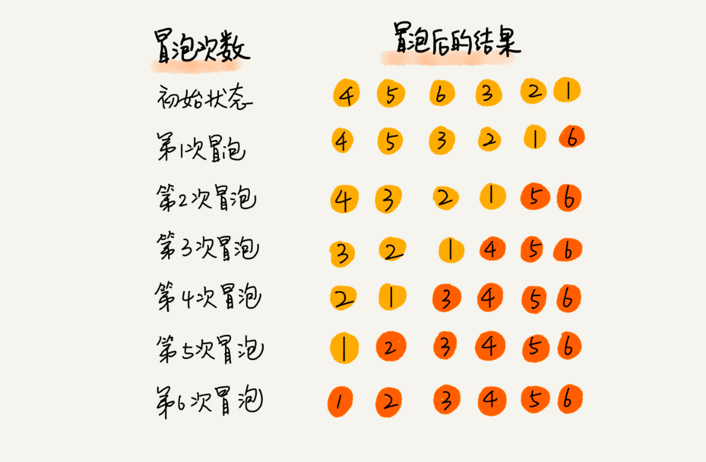
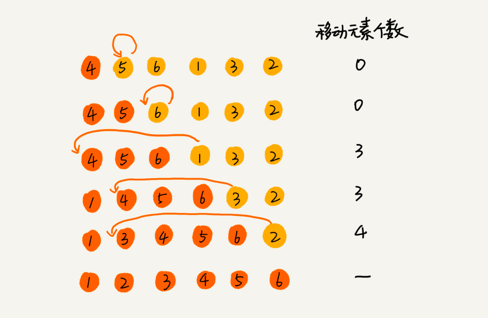
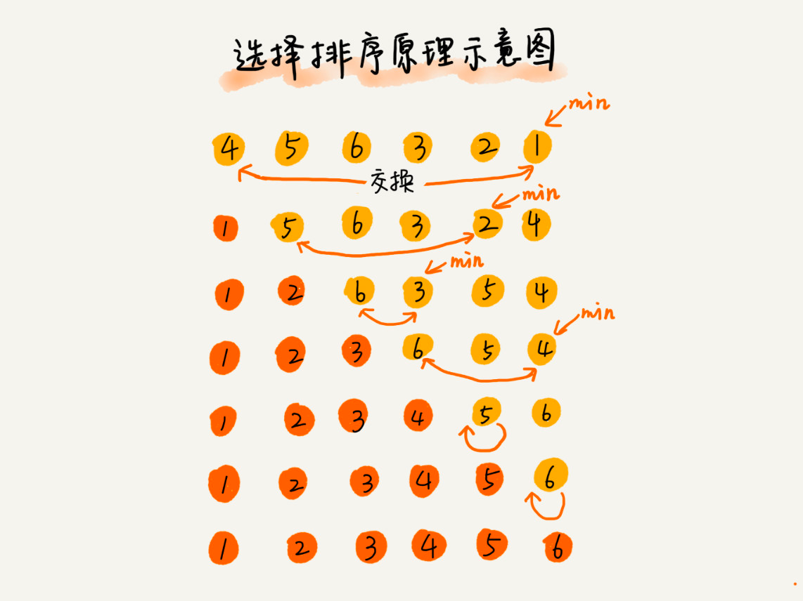
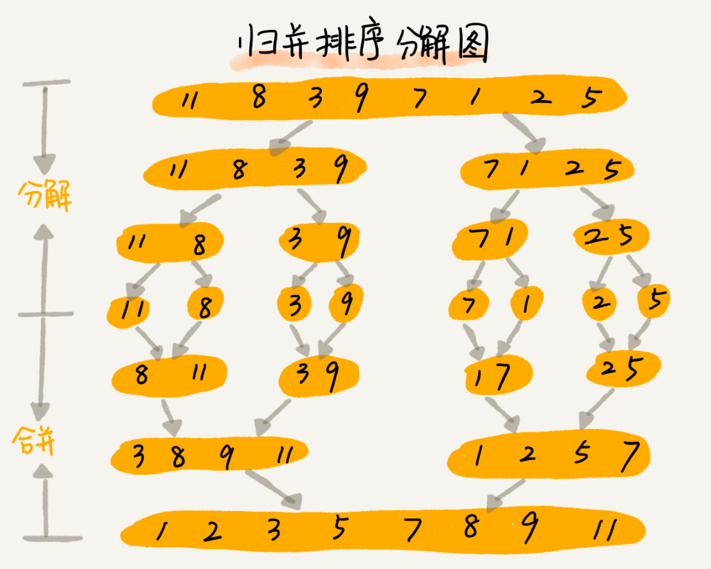
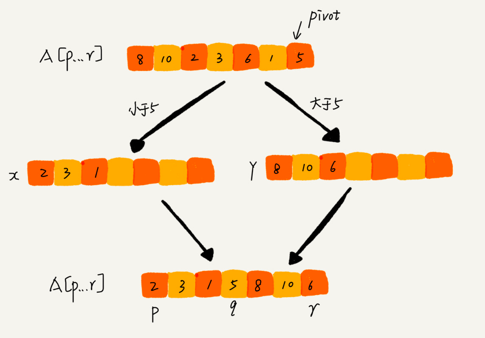
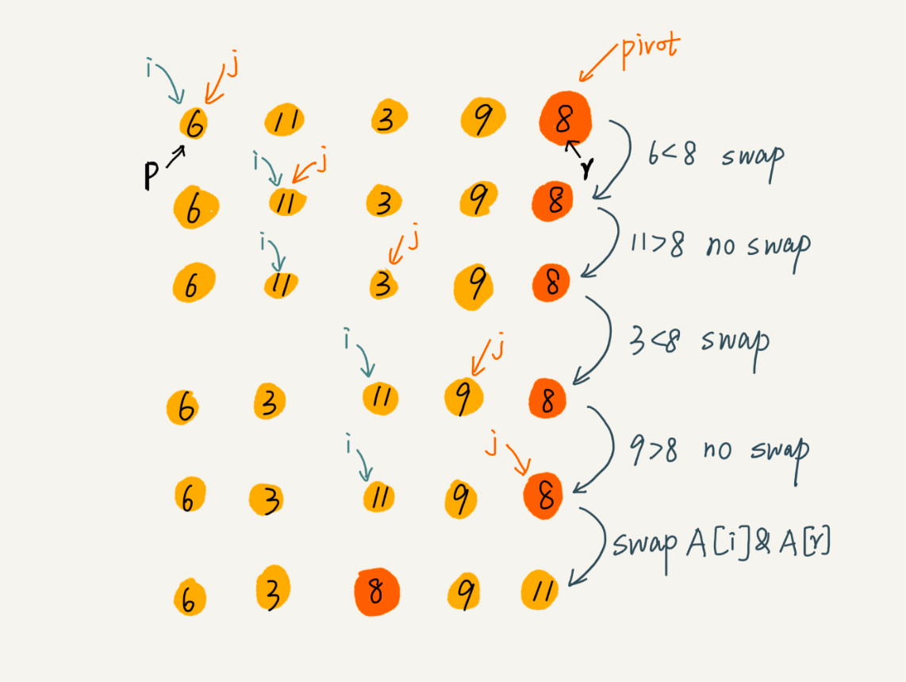

# 排序算法

## O(n^2)

### 冒泡排序

- 只操作相邻的两个数据，每次排序会让至少1个元素移动到它应该在的位置；
- 重复N次，完成N个数据的排序工作；

### 插入排序

- 将数组分成已排序区和未排序区
- 初始状态已排序区间只有一个元素，数组第一个元素
- 核心思想就是取未排序区的元素，通过一个一个对比在**已排序区**中找到合适的位置插入，并且保证已排序区的有序
- 重复上述流程直到未排序区中的元素为空；

### 选择排序

- 和上述类似，将数组分成已排序区和未排序区
- 核心思想是选择，每次都是选择未排序区最小的元素，放在已排序区的末尾，已排序区初始没有元素；

## O(nlogn)

### 归并排序 - merge sort
> 关键词：分治、递归

- 归并排序 核心其实是 分解->排序->合并排序后的自己，难点在于合并函数
- 合并这一步，必须要用到额外的空间，所以不是原地排序，空间复杂度为O(n)
> 因为这一点，所以归并排序用得少，大多用的是快排；但是分治思想值得借鉴；

### 快排 - quick sort
> 关键词：分治、递归、分区

- 快速排序 核心就是 找到pivot，根据pivot排序确认分区 -> 再对分区后的左右两个区间做前面同样的操作
- 难点在于分区算法

  
- 快速排序算法虽然最坏情况下的时间复杂度是 O(n2)，但是平均情况下时间复杂度都是 O(nlogn)。不仅如此，快速排序算法时间复杂度退化到 O(n2) 的概率非常小，我们可以通过合理地选择 pivot 来避免这种情况。

## O(n)