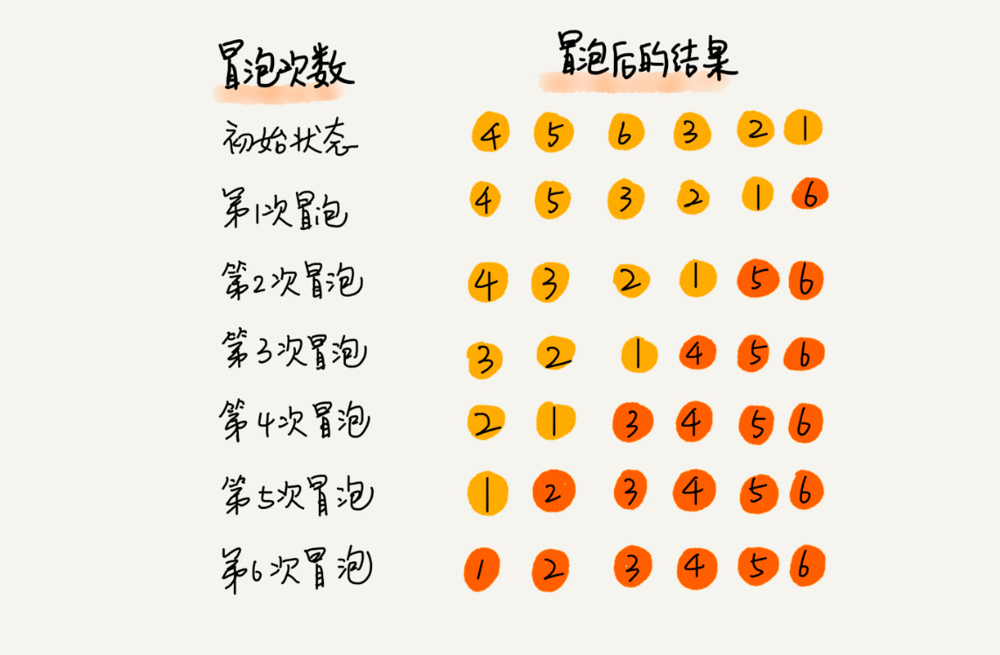
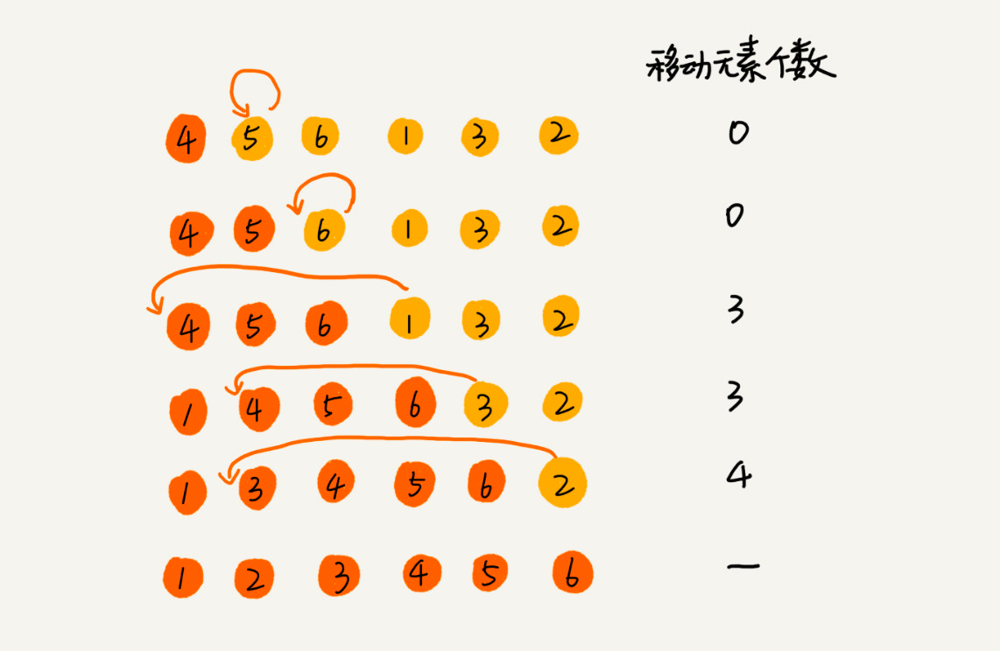
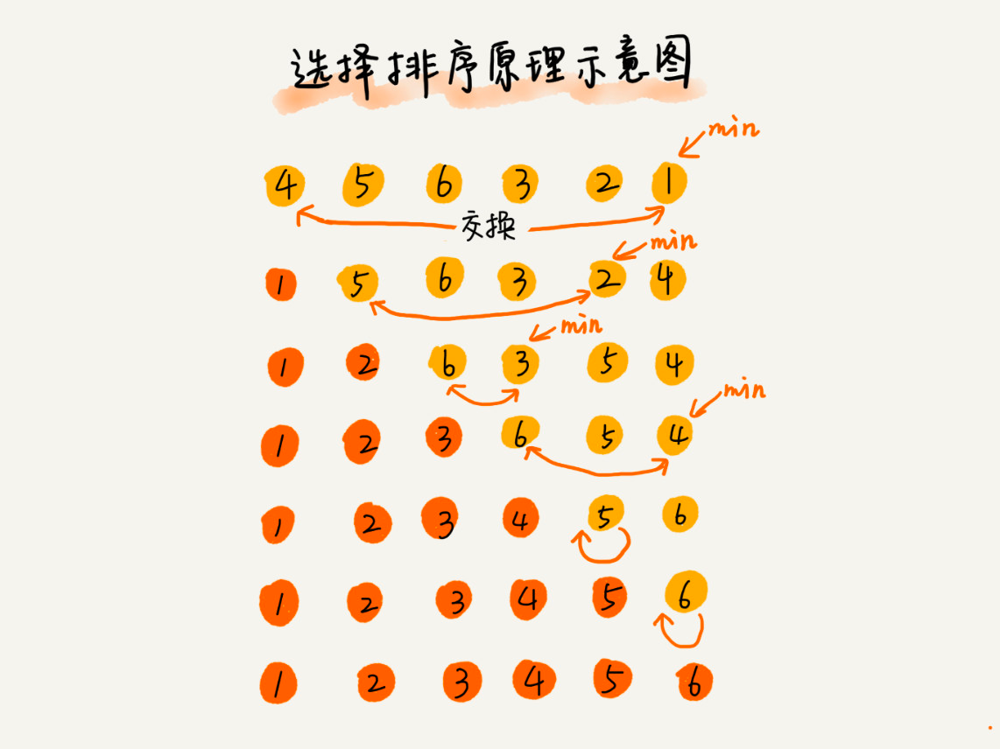
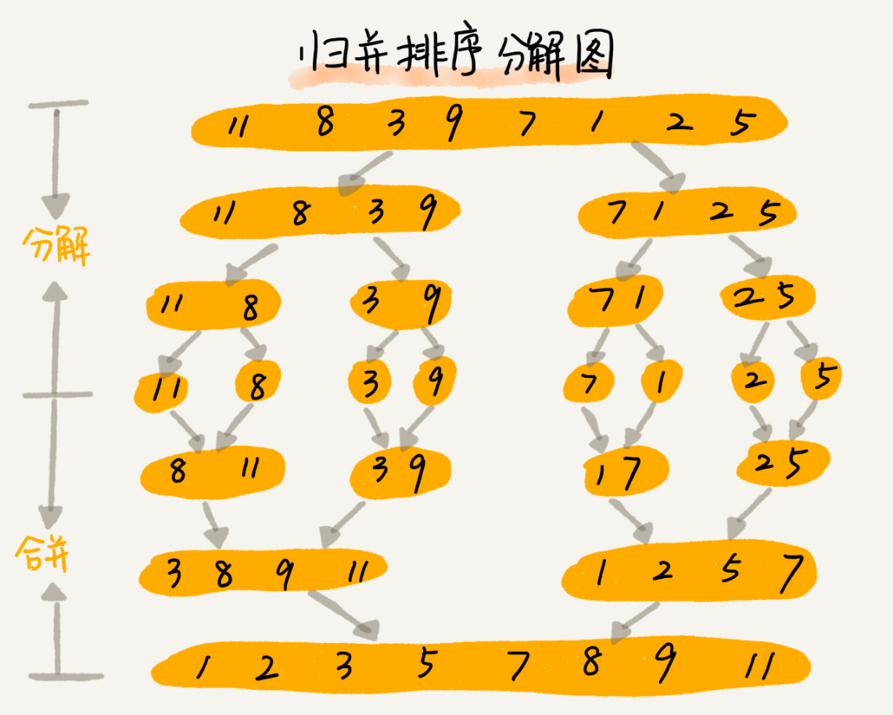
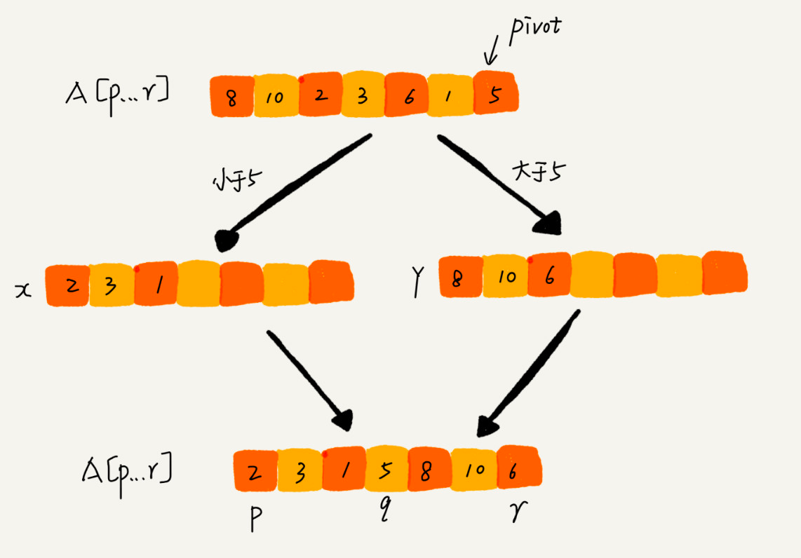
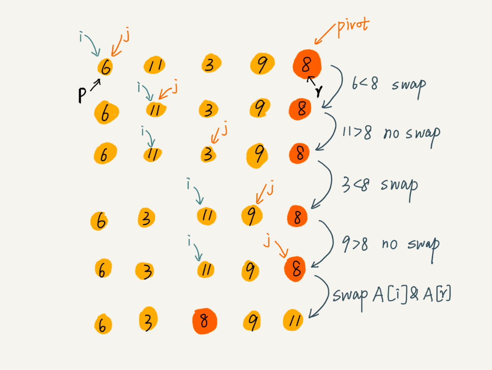
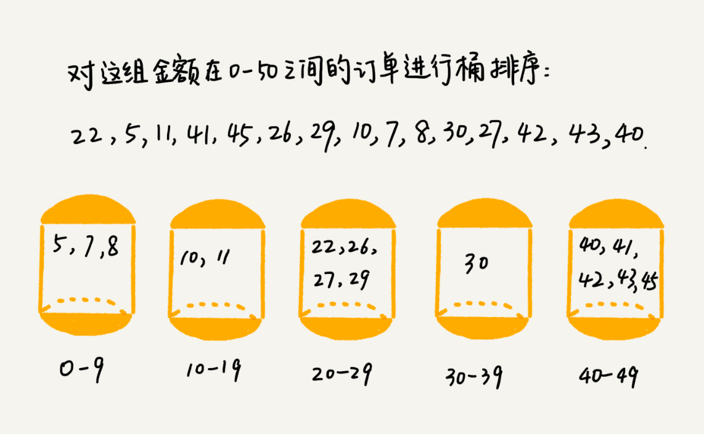
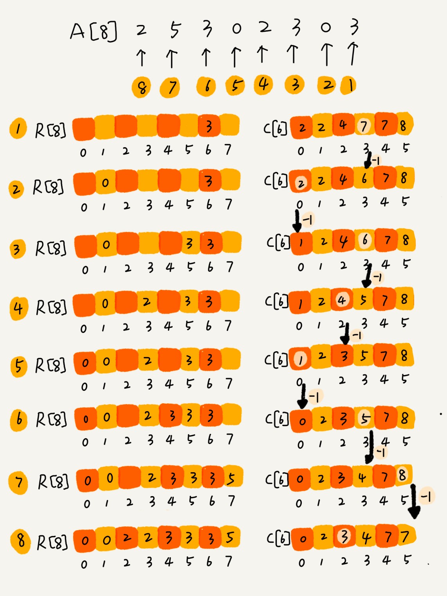

# 排序算法

## O(n^2)

### 冒泡排序

- 只操作相邻的两个数据，每次排序会让至少1个元素移动到它应该在的位置；
- 重复N次，完成N个数据的排序工作；

### 插入排序

- 将数组分成已排序区和未排序区
- 初始状态已排序区间只有一个元素，数组第一个元素
- 核心思想就是取未排序区的元素，通过一个一个对比在**已排序区**中找到合适的位置插入，并且保证已排序区的有序
- 重复上述流程直到未排序区中的元素为空；

### 选择排序

- 和上述类似，将数组分成已排序区和未排序区
- 核心思想是选择，每次都是选择未排序区最小的元素，放在已排序区的末尾，已排序区初始没有元素；

## O(nlogn)

### 归并排序 - merge sort
> 关键词：分治、递归

- 归并排序 核心其实是 分解->排序->合并排序后的自己，难点在于合并函数
- 合并这一步，必须要用到额外的空间，所以不是原地排序，空间复杂度为O(n)
> 因为这一点，所以归并排序用得少，大多用的是快排；但是分治思想值得借鉴；

### 快排 - quick sort
> 关键词：分治、递归、分区

- 快速排序 核心就是 找到pivot，根据pivot排序确认分区 -> 再对分区后的左右两个区间做前面同样的操作
- 难点在于分区算法

  
- 快速排序算法虽然最坏情况下的时间复杂度是 O(n2)，但是平均情况下时间复杂度都是 O(nlogn)。不仅如此，快速排序算法时间复杂度退化到 O(n2) 的概率非常小，我们可以通过合理地选择 pivot 来避免这种情况。

## O(n)

### 桶排序 - bucket sort

- 桶排序的核心，根据数据的上界和下界，分成N个有序的桶，将数据按照范围放进去，再对每个桶做快排，然后按照桶的顺序依次取出，组成的序列就是有序的了

> 时间复杂度 `O(n*log(n/m))`
> 如果要排序的数据有 n 个，我们把它们均匀地划分到 m 个桶内，每个桶里就有 k=n/m 个元素。每个桶内部使用快速排序，时间复杂度为 O(k * logk)。m 个桶排序的时间复杂度就是 O(m * k * logk)，因为 k=n/m，所以整个桶排序的时间复杂度就是 O(n*log(n/m))。当桶的个数 m 接近数据个数 n 时，log(n/m) 就是一个非常小的常量，这个时候桶排序的时间复杂度接近 O(n)。

桶排序对数据的要求：
1. 首先，要排序的数据需要很容易就能划分成 m 个桶，并且，桶与桶之间有着天然的大小顺序。这样每个桶内的数据都排序完之后，桶与桶之间的数据不需要再进行排序。
2. 其次，数据在各个桶之间的分布是比较均匀的。如果数据经过桶的划分之后，有些桶里的数据非常多，有些非常少，很不平均，那桶内数据排序的时间复杂度就不是常量级了。在极端情况下，如果数据都被划分到一个桶里，那就退化为 `O(nlogn)` 的排序算法了。

桶排序适合的场景：外部排序
> 数据存储在外部磁盘中，数据量比较大，内存有限，无法将数据全部加载到内存中。

> 即：待排序数据量比较大，内存有限的排序场景

### 计数排序 - counting sort
计数排序其实是桶排序的一种特殊情况。**当要排序的n个数据，所处的范围并不大时**，比如最大值是 k，我们就可以把数据划分成 k 个桶。**每个桶内的数据值都是相同的**，省掉了桶内排序的时间。

生动的例子：
> 我们都经历过高考，高考查分数系统你还记得吗？我们查分数的时候，系统会显示我们的成绩以及所在省的排名。如果你所在的省有 50 万考生，如何通过成绩快速排序得出名次呢？考生的满分是 900 分，最小是 0 分，这个数据的范围很小，所以我们可以分成 901 个桶，对应分数从 0 分到 900 分。根据考生的成绩，我们将这 50 万考生划分到这 901 个桶里。桶内的数据都是分数相同的考生，所以并不需要再进行排序。我们只需要依次扫描每个桶，将桶内的考生依次输出到一个数组中，就实现了 50 万考生的排序。因为只涉及扫描遍历操作，所以时间复杂度是 O(n)。

最难的地方就是计数完之后，怎么排序的问题。核心思路就是下面这张图

计数排序适用场景：
> 计数排序只能用在数据范围不大的场景中，如果数据范围 k 比要排序的数据 n 大很多，就不适合用计数排序了。而且，计数排序只能给非负整数排序，如果要排序的数据是其他类型的，要将其在不改变相对大小的情况下，转化为非负整数。