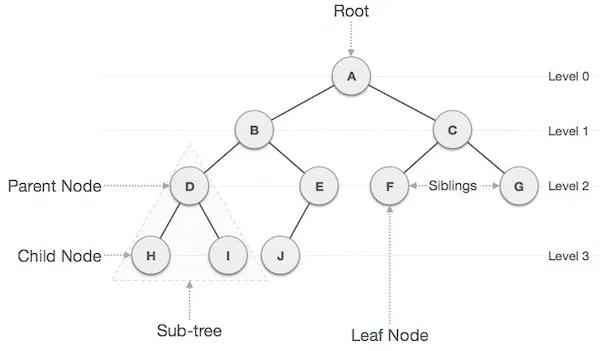

## 树的基础概念

- root : 根节点
- parent node / child node : 父节点 / 子节点
- leaf node : 尾节点
- edge : 相连线
- sub tree : 子树
- height : 节点的高度，此节点到尾节点之间相邻线的数量
- depth : 节点的深度，此节点到根节点之间相邻线的数量

## 树的种类
树的种类有很多，其中排序二叉树会是我们的重点，在后面也会学习如何用Java将其实现，至于其他的树类型，只要大概理解就好：

- 二叉树（Binary Tree）：每个节点最多含有两个子节点，上面图示中的树就是二叉树。
- 完全二叉树（Complete Binary Tree）：假设一个二叉树深度（depth）为d（d > 1），除了第d层外，其它各层的节点数量均已达到最大值，且第d层所有节点从左向右紧密排列，这样的二叉树就是完全二叉树。
- 满二叉树（Full Binary Tee）：在满二叉树中，每个不是尾节点的节点都有两个子节点。
- 排序二叉树（Binary Search Tree）：在此树中，每个节点的数值比左子树上的每个节点都大，比所有右子树上的节点都小。
- 平衡二叉树（AVL Tree）：任何节点的两颗子树的高度差不大于1的二叉树。
- B树（B-Tree）：B树和平衡二插树一样，只不过它是一种多叉树（一个节点的子节点数量可以超过二）。
- 红黑树（Red—Black Tree）：是一种自平衡二叉寻找树。

## 二分查找树 binary sorted tree (BST)

- **每个节点都比自己左子树上的节点大，并比右子树上的节点小**。如果我们想要寻找一个特定的元素，只需要依赖其特性，顺着特定的路径就能找到目标。
- 搜索、插入和删除的复杂度等于树高，往往就是O(logN)，非常合适用来存储数据。

## 树的遍历 Tree Traversal

- 后序遍历 Post-order Traversal
  先访问左右子树，最后再访问自己
- 先序遍历 Pre-order Traversal
  先访问节点自己，然后访问左子树，然后访问右子树
- 中序遍历 In-order Traversal
  先访问左子树节点，然后访问自己，然后访问右子树上节点
  
> 如果使用中序遍历二分查找树，我们得到的结果就会是排好序的数值。
